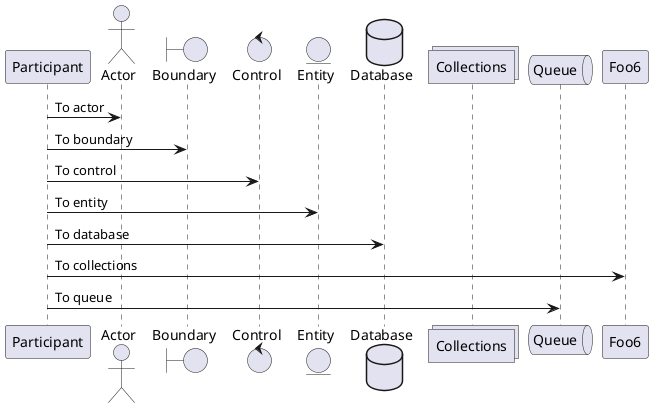

---
{"dg-publish":true,"permalink":"/20220917-000-np-exec-exec-sp-executesql/","dgHomeLink":true,"dgPassFrontmatter":false}
---


# <font color=#DC143C>(20220917)-(语句学习)-(000)-(NP)-(EXEC与EXEC SP_EXECUTESQL的用法及比较)</font>
URL:: 

```
dataview
table without id 入榜亮点, 入榜输出
where contains(TITLES, "")
```

```dataview
table without id 萃取重点, 萃取难点, 萃取锚点, 萃取输出
where contains(TITLES, "EXEC与EXEC SP_EXECUTESQL的用法及比较")
```

>[!background] 背景介绍
>exec与exec sp_executesql都可以用于执行动态sql。下面先介绍它们的用法，然后再对它们进行比较。
>下面用到的数据库表来自SQL SERVER的示例数据库AdventureWorks2008

## 01.exec与exec sp_executesql用法
### 0101.动态SQL(使用字符串拼接的方式)
+ `萃取重点`:: <strong><font color=#E6E022>SP_EXECUTESQL不能接收含有变量拼接的SQL字符串</font></strong>
+ `萃取重点`:: 不推荐使用方式——定义拼接(<strong><font color=#E6E022>变量写在SET</font></strong>)
```SQL
declare @FName2 varchar(20) = 'Ken',
        @PeronType varchar(10) = 'GC',
        @sql nvarchar(1000);
--  不推荐这样使用
exec('select * from Person.Person where FirstName =''' + @FName2 + ''' and PersonType= ''' + @PeronType + '''')
-- sp_executesql 不能接收含有变量拼接的sql字符串。下面的sql执行会报错
-- exec sp_executesql 'select * from Person.Person where FirstName =''' + @FName2 + ''' and PersonType= ''' + @PeronType + ''''
-- 不推荐这样使用：无法防止SQL注入,无法重用执行计划，拼接麻烦且容易出错（字符串类型的需要单引号括起来）
set @sql =  'select * from Person.Person where FirstName =''' + @FName2 + ''' and PersonType= ''' + @PeronType + ''''
exec sp_executesql @sql
```




```SQL

/*
不推荐这样使用：
(1)
(2)无法重用执行计划
(3)拼接麻烦且容易出错，字符串类型的需要单引号括起来
*/
SET @sql = 'select * from Person.Person where FirstName =''' + @FName2 + ''' and PersonType= ''' + @PeronType + '''';
EXEC sp_executesql @sql;
--[1.2]==============================================带有输入参数时的使用
--[1.2.1]======================
DECLARE @FName2 VARCHAR(20) = 'Ken', @PeronType VARCHAR(10) = 'GC', @sql NVARCHAR(1000);
--推荐先使用变量存放拼接的sql，再使用exec执行sql
SET @sql = 'select * from Person.Person where FirstName =''' + @FName2 + ''' and PersonType= ''' + @PeronType + ''''
EXEC(@sql)
--[1.2.2]======================
/*
推荐这样使用(可以防止SQL注入，可以重用执行计划)
此处输入参数要加上N,不然会报错：过程需要类型为 'ntext/nchar/nvarchar' 的参数 '@params
*/
SET @sql = 'select * from Person.Person where FirstName =@FName and PersonType=@PersonType'
EXEC sp_executesql @sql, N'@FName varchar(20), @PersonType varchar(10)', @FName2, @PeronType
/*
注：exec 只能使用拼接字符串的方式，不支持使用输入参数，而且执行计划不能重用。
因此，一般情况下，推荐使用 exec sp_executesql 的方式而不是exec。
*/
--[1.3]==============================================带有输入参数时的使用
DECLARE @sql NVARCHAR(1000), @cnt INT = -1;
/*
使用exec：
exec sql内无法访问sql之外定义的变量，直接使用下面的会报错： 必须声明变量 "@cnt"。外部也无法访问到 exec sql里定义的变量
无法直接将值传出，只能通过select 变量/insert into exec等方式看到值
exec('select @cnt=count(1) from Person.Person; select @cnt')
*/
EXEC('declare @cnt int; select @cnt=count(1) from Person.Person')
PRINT @cnt--无法访问 exec 里取到的@cnt的值
--[1.3.1]======================
SET @sql = 'select @cnt=count(1) from Person.Person'
EXEC sp_executesql @sql, N'@cnt int output', @cnt OUTPUT --此处必须加上ouput，不然无法取到值
PRINT @cnt
--[1.4]==============================================insert into exec/exec sp_executesql 的使用
DECLARE @tmp TABLE
(
BusinessEntityID INT,
FirstName VARCHAR(50),
LastName VARCHAR(50)
)
INSERT INTO @tmp EXEC sp_executesql N'select top 10 BusinessEntityID, FirstName, LastName from Person.Person'
INSERT INTO @tmp EXEC(N'select top 10 BusinessEntityID, FirstName, LastName from Person.Person')
SELECT * FROM @tmp
--[2]==============================================================================================exec 与 exec sp_executesql 比较
--[2.1]==============================================
--1. exec 与 exec sp_executesql 都可以用于执行动态sql
--2. sp_executesql 后面需要直接使用表示拼接后的sql的变量或者sql常量字符串，后面不能直接使用常量+变量拼接的语句
/*
如下面的语句会报错
DECLARE @FName2 VARCHAR(20) = 'Ken', @PeronType VARCHAR(10) = 'GC', @sql NVARCHAR(1000);
EXEC sp_executesql 'select * from Person.Person where FirstName =''' + @FName2 + ''' and PersonType= ''' + @PeronType + ''''
这种情况下，需要先将sql拼凑后的结果放入一个变量中，然后使用 exec sp_executesql 执行；或者使用入参的方式来实现。
推荐使用下面的方式：
DECLARE @FName2 VARCHAR(20) = 'Ken', @PeronType VARCHAR(10) = 'GC', @sql NVARCHAR(1000);
SET @sql = 'select * from Person.Person where FirstName = @FName2 and PersonType = @PeronType'
EXEC sp_executesql @sql, N'@FName varchar(20), @PersonType varchar(10)', @FName2, @PeronType
*/
--3. sp_executesql要求动态Sql和动态Sql参数列表必须是Nvarchar, 动态Sql的参数列表与外部提供值的参数列表顺序必需一致，且不能使用变量。
--4. exec 查询不能使用sql外面定义的变量，查询的结果也不容易进行使用。而exec sp_executesql 可以使用入参和出参的方式很方便的获取或者返回内容。
--5. sp_executesql可以建立带参数的查询字符串还可以重用执行计划。通过下面的示例来了解一下
/*
首先是 EXEC(通过上面的截图可以看到，执行三次生成了三次执行计划)

DBCC FREEPROCCACHE -- 清空执行计划缓存

DECLARE @Sql NVARCHAR(MAX), @ID INT;
SET @ID = 15; -- 15使用之后，换成10， 12等再次执行
SET @Sql = 'SELECT * FROM Person.Person WHERE BusinessEntityID = ' + CAST(@ID AS VARCHAR(10)) + ' ORDER BY BusinessEntityID DESC'
EXEC(@Sql);

SELECT cacheobjtype, objtype, usecounts, sql
FROM sys.syscacheobjects
WHERE sql NOT LIKE '%cach%'
AND sql NOT LIKE '%sys.%'
*/
/*
通过上面的截图可以看到，只生成了一次执行计划。
DBCC FREEPROCCACHE

DECLARE @Sql NVARCHAR(MAX), @ID INT;

SET @ID = 17;
SET @Sql = 'SELECT * FROM Person.Person WHERE BusinessEntityID = @ID ORDER BY BusinessEntityID DESC'

EXEC sp_executesql @Sql, N'@ID int', @ID

SELECT cacheobjtype, objtype, usecounts, sql
FROM sys.syscacheobjects
WHERE sql NOT LIKE '%cach%'
AND sql NOT LIKE '%sys.%'
*/
--6.sp_executesql可以建立带参数的查询字符串可以防止sql注入
/*
--下面的SQL注入
DECLARE @Sql NVARCHAR(MAX), @FName VARCHAR(20);
SET @FName = '''ken'' or 1=1';
SET @Sql = 'SELECT * FROM Person.Person WHERE FirstName = ' + @FName + ' ORDER BY BusinessEntityID DESC'
EXEC sp_executesql @Sql

--下面的可以防止SQL注入
DECLARE @Sql NVARCHAR(MAX), @FName VARCHAR(20);
SET @FName = '''ken'' or 1=1';
SET @Sql = 'SELECT * FROM Person.Person WHERE FirstName = @FName ORDER BY BusinessEntityID DESC'
EXEC sp_executesql @Sql, N'@FName varchar(20)', @FName
*/

```